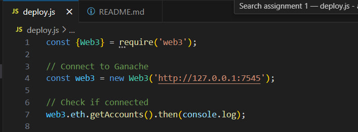
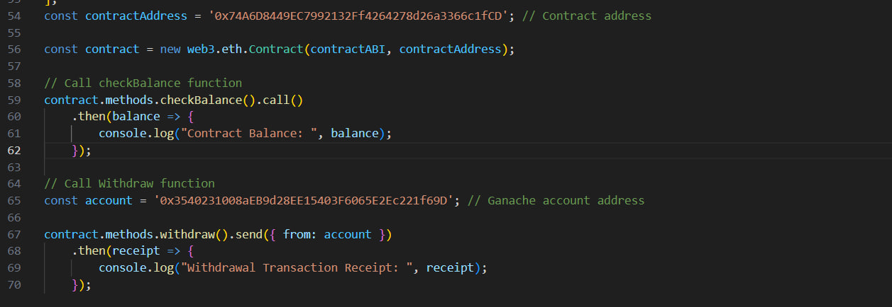

# Assignment 1


Smart contract deployment

Team members: 
- Nurgul Bassanova SE-2323
- Nurkasym Bolat SE-2325
- Ulzhan Tamyzgazina SE-2325


## Contents

1. [Project overview](#project-overview)
2. [Prerequisites](#prerequisites)
3. [Setup and installation](#setup-and-installation)
4. [Deployment](#deployment)
5. [Files](#files)
6. [License](#license)


## Project overview

- <b><i>Goal</i>:</b>  to design, deploy, and interact with a smart contract using Ethereum-compatible tools and frameworks
- <b><i>Tasks</i></b>:
    1. Write a smart contract with the following features: accepting Ether, allowing the owner to withdraw the balance, provide a balance-checking function.
    2. Configure web3.js and set up the environment.
    3. Connect web3.js to Ganache or a public testnet.
    4. Link Metamask to the chosen network.
    5. Deploy the smart contract.
    6. Test contract functions using the configured setup.
 

## Prerequisites

1. **Node.js** (version 14.x or later) - [Install Node.js](https://nodejs.org/)
2. **Ganache** - [Download Ganache](https://www.trufflesuite.com/ganache)
3. **MetaMask** browser extension - [Install MetaMask](https://metamask.io/)
4. **VS Code** - [Download VS Code](https://code.visualstudio.com/)


## Setup and installation 

### 1. Clone the repository:

```bash
git clone https://github.com/NurgulBassanova/Assignment1.git
cd Assignment1
```
### 2. Install dependencies:

```bash
npm install
```
### 3. Set up Ganache:
- Open Ganache and create a new workspace.
- Note the RPC server URL (usually http://127.0.0.1:7545).
- Ensure you have at least one account with Ether (Ganache provides some pre-funded accounts).

### 4. Set up MetaMask:
- Open MetaMask and create a new wallet if you haven't already.
- Connect MetaMask to your local Ganache network using the RPC URL from Ganache (http://127.0.0.1:7545).
= Import one of the Ganache accounts into MetaMask using the private key provided by Ganache.


### 5. Deploy the Contract:
```bash
node deploy.js
```

### Smart Contract
The smart contract used in this project supports the following functions:

`checkBalance()`: Returns the current Ether balance of the contract.

`withdraw()`: Transfers all Ether from the contract to the owner's address.

`receive()`: Allows the contract to accept Ether directly.

## Deployment


Highlights the deployment script (deploy.js) with the configuration for connecting to the Ganache blockchain. Also as you can see using Web3, which is declared as `const {Web3}`.





A view of the deployment script opened in VS Code, showcasing the JavaScript logic used for deploying the contract.

