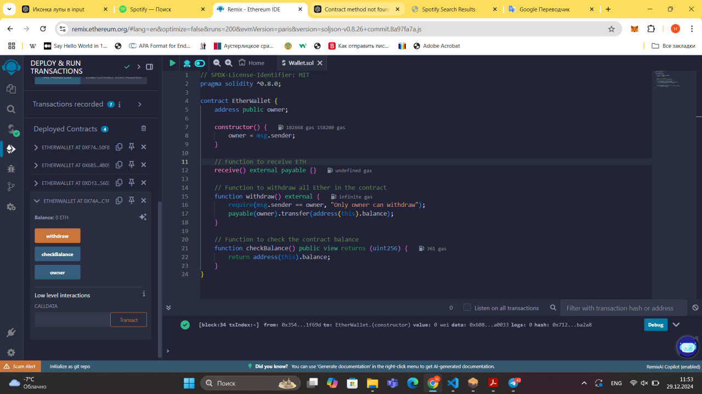
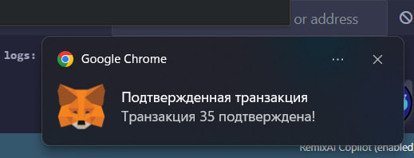
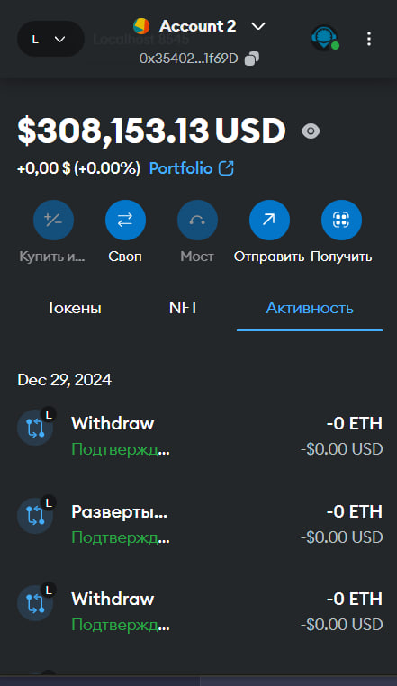
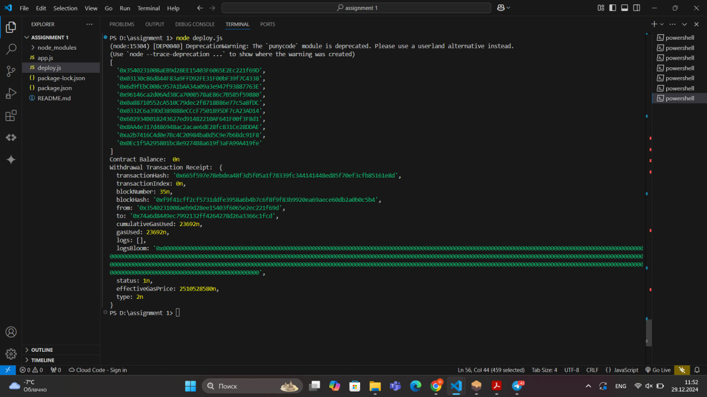
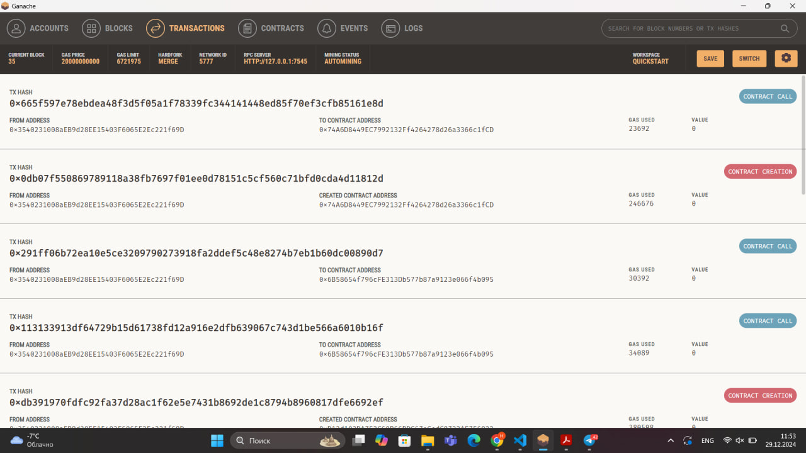
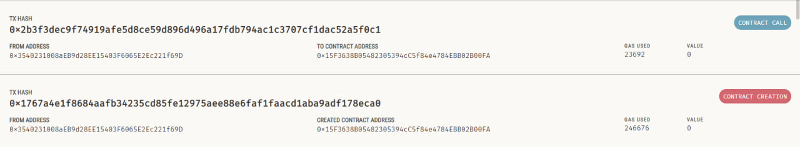

# Assignment 1


 Smart contract deployment

### Team members: 
- Nurgul Bassanova SE-2323
- Nurkasym Bolat SE-2325
- Ulzhan Tamyzgazina SE-2325


## Contents

1. [Project overview](#project-overview)
2. [Prerequisites](#prerequisites)
3. [Setup and installation](#setup-and-installation)
4. [Deployment](#deployment)
5. [Files](#files)
6. [License](#license)


## Project overview

- <b><i>Goal</i>:</b>  to design, deploy, and interact with a smart contract using Ethereum-compatible tools and frameworks
- <b><i>Tasks</i></b>:
    1. Write a smart contract with the following features: accepting Ether, allowing the owner to withdraw the balance, provide a balance-checking function.
    2. Configure web3.js and set up the environment.
    3. Connect web3.js to Ganache or a public testnet.
    4. Link Metamask to the chosen network.
    5. Deploy the smart contract.
    6. Test contract functions using the configured setup.
 

## Prerequisites

1. **Node.js** (version 14.x or later) - [Install Node.js](https://nodejs.org/)
2. **Ganache** - [Download Ganache](https://www.trufflesuite.com/ganache)
3. **MetaMask** browser extension - [Install MetaMask](https://metamask.io/)
4. **VS Code** - [Download VS Code](https://code.visualstudio.com/)


## Setup and installation 

### 1. Clone the repository:

```bash
git clone https://github.com/NurgulBassanova/Assignment1.git
cd Assignment1
```
### 2. Install dependencies:

```bash
npm install
```
### 3. Set up Ganache:
- Open Ganache and create a new workspace.
- Note the RPC server URL (usually http://127.0.0.1:7545).
- Ensure you have at least one account with Ether (Ganache provides some pre-funded accounts).

### 4. Set up MetaMask:
- Open MetaMask and create a new wallet if you haven't already.
- Connect MetaMask to your local Ganache network using the RPC URL from Ganache (http://127.0.0.1:7545).
= Import one of the Ganache accounts into MetaMask using the private key provided by Ganache.


### 5. Deploy the Contract:
```bash
node deploy.js
```


## Deployment


Highlights the deployment script (deploy.js) with the configuration for connecting to the Ganache blockchain. Also, as you can see using Web3, which is declared as `const {Web3}`.


A view of the deployment script opened in VS Code, showcasing the JavaScript logic used for deploying the contract.



Shows the smart contract code in Remix IDE, where it was written, compiled, and tested for functionality.

The smart contract used in this project supports the following functions:

- `checkBalance()`: Returns the current Ether balance of the contract.
- `withdraw()`: Transfers all Ether from the contract to the owner's address.
- `receive()`: Allows the contract to accept Ether directly.


Displays the MetaMask popup requesting user confirmation for the transaction to deploy the smart contract.



Shows the MetaMask notification confirming the successful approval of the transaction.



A view of our MetaMask account, where you can see that tranaction is deployed. 



Captures the terminal output in VS Code after executing the deployment script, including transaction details such as the contract address and status.


Displays the Ganache interface, showing the details of the contract creation and any calls made to it.

## Conclusion

We created a smart contract that can receive Ether, let the owner withdraw Ether, and check the balance of the contract. This shows how smart contracts work on the Ethereum blockchain. 
We set up the environment by installing the Web3.js library, which helps connect to the Ethereum network. 
We also configured Ganache and Metamask to work together, making it easier to interact with the blockchain. The smart contract was successfully deployed on Ganache, a local test network, and its functions were tested by calling them from the environment we set up.




## Files

- deploy.js: Javascript script to deploy the smart contact within environment(VS code) with Ganache settings
- smartcontract.sol: Solidity script to deploy the smart contact with Metamask account
- README.md: explanatory text file
- LICENSE: MIT license
- package.json, package-lock.json, node_modules: libraries to use web3 and node.js
- images: folder for screenshoots

## References

Bhargav, K. (2020, August 17). Blockchain for beginners. Medium. Retrieved from https://medium.com/@kacharlabhargav21/

Truffle Suite. (n.d.). Ganache. Retrieved from https://trufflesuite.com/ganache/

Web3.js documentation. (2021). Getting started. Retrieved from https://web3js.readthedocs.io/en/v1.10.0/getting-started.html

Web3.py documentation. (n.d.). Quickstart. Retrieved from https://web3py.readthedocs.io/en/stable/quickstart.html

Traversy Media. (2018, December 20). Ethereum & Smart Contracts for Beginners (2020) - Full Course. Retrieved from https://www.youtube.com/watch?v=t3wM5903ty0&list=PLS5SEs8ZftgXlCGXNfzKdq7nGBcIaVOdN

